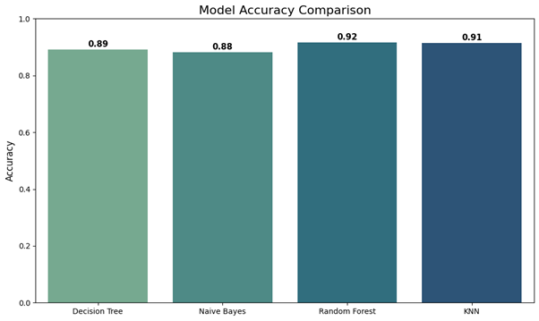
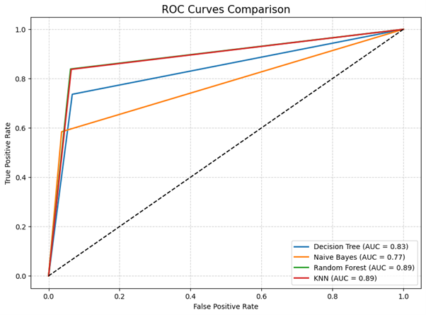
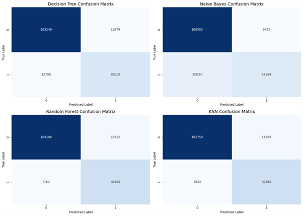

<<<<<<< HEAD
# 🕵️‍♂️ Los Angeles Crime Pattern Analysis and Prediction System

> *An applied machine learning project for binary classification of violent vs non-violent crimes using Los Angeles Police Department data (2020–2025).*

**Author:** Abdullah Master  
**PRN:** 22070521001
**Institution:** Symbiosis Institute of Technology, Nagpur  
**Course:** Machine Learning (B.Tech CSE – Honors in AIML)  
**Date:** October 28, 2025  

---


## 📌 Project Overview

This project tackles the critical challenge of predicting crime types in Los Angeles by developing and comparing multiple machine learning classification models. The system distinguishes between violent and non-violent criminal incidents using historical crime data spanning five years (2020-2025).

Law enforcement agencies face resource allocation challenges when responding to crime incidents. By accurately predicting whether a reported crime is violent or non-violent, this system enables:
- Strategic deployment of emergency response units
- Optimized allocation of patrol resources
- Enhanced preventive measures in high-risk areas
- Data-driven policy decisions for public safety

**Key Achievement:** The Random Forest model achieved **91.7% accuracy** in crime type classification, demonstrating strong predictive capability across 1.98 million crime records.

---

## 🎯 Problem Statement

Urban crime prediction presents a complex classification problem with significant real-world implications. The primary objective is to develop a binary classification system that categorizes crimes as either:
- **Violent:** Homicide, robbery, rape, aggravated assault, battery
- **Non-Violent:** Burglary, theft, vandalism, fraud, vehicle-related crimes

This distinction is crucial because violent crimes require immediate, specialized response protocols, while non-violent crimes may be handled through different resource allocation strategies. The challenge lies in identifying patterns across diverse features including temporal, spatial, demographic, and categorical variables.

---

## 📊 Dataset Information

### Source
- **Platform:** Kaggle  
- **Dataset Name:** Crime Data from 2020 to Present  
- **URL:** [https://www.kaggle.com/datasets/shubhamgupta012/crime-data-from-2020-to-present](https://www.kaggle.com/datasets/shubhamgupta012/crime-data-from-2020-to-present)

### Dataset Characteristics

| Attribute | Details |
|-----------|---------|
| **Total Records** | 1,987,421 crime incidents |
| **Time Period** | January 2020 - September 2025 |
| **Geographic Coverage** | Los Angeles County, California |
| **Feature Count** | 18 processed features |
| **Class Distribution** | Violent: 742,000 (37.3%) <br> Non-Violent: 1,245,000 (62.7%) |

### Selected Features for Modeling

Six features were carefully selected based on their predictive relevance and availability:

1. **AREA** - Geographic district code within Los Angeles
2. **hour** - Time of day when crime occurred (0-23)
3. **month** - Month of occurrence (1-12) for seasonal patterns
4. **Vict Age** - Age of the victim
5. **Premis Cd** - Premise type code (residential, commercial, street, etc.)
6. **Weapon Used Cd** - Weapon category code (if applicable)

### Data Preprocessing Pipeline

The raw dataset underwent extensive preprocessing to ensure model reliability:

1. **Temporal Feature Engineering**
   - Extracted year, month, and hour from datetime fields
   - Converted time codes to 24-hour format for standardization

2. **Outlier Treatment**
   - Applied Interquartile Range (IQR) method to victim age
   - Removed records with ages below Q1 - 1.5×IQR and above Q3 + 1.5×IQR

3. **Categorical Encoding**
   - Label encoding for area codes, premise codes, and weapon codes
   - Binary encoding for crime type classification

4. **Missing Value Handling**
   - Dropped rows with null values in critical features
   - Ensured data completeness for all selected features

5. **Crime Classification Logic**
   - Defined violent crime categories based on FBI Uniform Crime Reporting standards
   - Created binary target variable: 'violent' vs 'nonviolent'

The preprocessing reduced the dataset from its original size while maintaining data integrity and ensuring all records contained complete information for the selected features.

---

## 🔬 Methodology

### Problem Formulation

This project frames crime prediction as a **supervised binary classification task**. Given a set of features describing a crime incident, the goal is to predict whether the crime belongs to the violent or non-violent category.

**Mathematical Formulation:**
- Input: Feature vector X = [AREA, hour, month, Vict Age, Premis Cd, Weapon Used Cd]
- Output: Y ∈ {violent, nonviolent}
- Objective: Learn function f: X → Y that maximizes classification accuracy

### Model Selection Rationale

Four distinct machine learning algorithms were selected to provide comprehensive comparison across different learning paradigms:

#### 1. Decision Tree Classifier
**Rationale:** Decision trees offer interpretability through rule-based decisions, making them valuable for understanding which features drive crime type predictions. Their ability to handle non-linear relationships without feature scaling makes them suitable for mixed feature types.

**Configuration:**
- Criterion: Gini impurity
- No explicit depth limitation (default parameters)
- Provides feature importance rankings

#### 2. Naive Bayes Classifier
**Rationale:** This probabilistic approach handles both numerical and categorical features efficiently. The combination of Gaussian Naive Bayes for continuous features and Categorical Naive Bayes for discrete features leverages the strengths of both variants.

**Configuration:**
- Gaussian NB for: hour, month, victim age
- Categorical NB for: area, premise code, weapon code
- Ensemble prediction through probability averaging

#### 3. Random Forest Classifier
**Rationale:** As an ensemble method, Random Forest reduces overfitting while maintaining high accuracy. It's particularly effective for complex datasets with feature interactions and provides robust performance across varying conditions.

**Configuration:**
- Number of trees: 50
- Maximum depth: 25
- Maximum features per split: 4
- Split criterion: Gini impurity

#### 4. K-Nearest Neighbors (KNN)
**Rationale:** KNN provides instance-based learning without making distributional assumptions. It captures local patterns in the feature space, which is valuable for identifying crime clusters.

**Configuration:**
- K value: 19 (optimized through error rate analysis)
- Distance metric: Euclidean
- Missing value imputation: Mean strategy

### Alternative Approaches Considered

During the design phase, several alternative methodologies were evaluated:

1. **Support Vector Machines (SVM):** Not implemented due to computational complexity with nearly 2 million records. SVMs scale poorly with large datasets, making them impractical for this project's scope.

2. **Deep Learning (Neural Networks):** While potentially more accurate, neural networks lack interpretability. Given the public safety context, stakeholders require explainable predictions, making tree-based and probabilistic models more appropriate.

3. **Logistic Regression:** Initially considered as a baseline, but preliminary analysis showed that crime type relationships are highly non-linear, making linear models suboptimal.

4. **XGBoost/Gradient Boosting:** Recognized as potentially superior performers but excluded to maintain computational efficiency and focus on fundamental ML algorithms as per assignment requirements.

### Evaluation Strategy

The evaluation framework emphasizes multiple metrics to provide comprehensive performance assessment:

- **Primary Metric:** Accuracy (overall correctness)
- **Confusion Matrix:** Analyzes true positives, false positives, true negatives, false negatives
- **ROC-AUC Score:** Measures discriminative ability across classification thresholds
- **Precision & Recall:** Evaluates model performance on minority class (violent crimes)

**Train-Test Split:** 70% training, 30% testing with random_state=42 for reproducibility.

---

## 💻 Implementation Details

### Technology Stack

```python
Core Libraries:
- Python: Primary programming language
- NumPy [3]: Numerical computations
- Pandas [4]: Data manipulation and analysis
- Scikit-learn [2]: Machine learning algorithms

Visualization:
- Matplotlib [5]: Static plotting
- Seaborn [6]: Statistical visualizations

Key Scikit-learn Modules:
- sklearn.tree.DecisionTreeClassifier
- sklearn.naive_bayes (GaussianNB, CategoricalNB)
- sklearn.ensemble.RandomForestClassifier
- sklearn.neighbors.KNeighborsClassifier
- sklearn.preprocessing (LabelEncoder, StandardScaler)
- sklearn.metrics (accuracy_score, confusion_matrix, roc_curve, auc)
```

### Project Structure

```
LA-Crime-Analysis/
│
├── README.md                          # Project documentation
├── crime_analysis.ipynb               # Main Jupyter notebook
├── requirements.txt                   # Python dependencies
│
├── data/
│   └── Crime_Data_from_2020_to_Present.csv
│
├── images/
   ├── model_accuracy_comparison.png
   ├── roc_curves_comparison.png
   ├── confusion_matrices.png

```

### Installation & Setup

1. **Clone the Repository**
```bash
git clone <your-github-repo-url>
cd LA-Crime-Analysis
```

2. **Install Dependencies**
```bash
pip install -r requirements.txt
```

Required packages:
```
numpy>=1.21.0
pandas>=1.3.0
matplotlib>=3.4.0
seaborn>=0.11.0
scikit-learn>=1.0.0
jupyter>=1.0.0
```

3. **Download Dataset**
- Option A: Download from [Kaggle](https://www.kaggle.com/datasets/shubhamgupta012/crime-data-from-2020-to-present)
- Option B: Use Kaggle API:
```bash
kaggle datasets download -d shubhamgupta012/crime-data-from-2020-to-present
```
- Place the CSV file in the `data/` directory

### Running the Code

**Option 1: Jupyter Notebook (Recommended)**
```bash
jupyter notebook crime_analysis.ipynb
```
Execute cells sequentially from top to bottom.

**Option 2: Python Script Conversion**
```bash
jupyter nbconvert --to script crime_analysis.ipynb
python crime_analysis.py
```

### Expected Execution Flow

1. Data loading and initial exploration (~30 seconds)
2. Preprocessing and feature engineering (~2-3 minutes)
3. Model training:
   - Decision Tree: ~1 minute
   - Naive Bayes: ~30 seconds
   - Random Forest: ~3-5 minutes
   - KNN: ~2 minutes
4. Evaluation and visualization: ~1 minute

**Note:** Processing times vary based on system specifications. The complete notebook executes in approximately 10-15 minutes on standard hardware.

---

## 📈 Experiments and Results

### Model Performance Comparison

| Model | Accuracy | Precision (Violent) | Recall (Violent) | F1-Score | AUC-ROC |
|-------|----------|---------------------|------------------|----------|---------|
| **Random Forest** | **91.7%** | 0.84 | 0.84 | 0.84 | 0.89 |
| **K-Nearest Neighbors** | **91.5%** | 0.83 | 0.84 | 0.83 | 0.89 |
| **Decision Tree** | 89.1% | 0.75 | 0.73 | 0.74 | 0.83 |
| **Naive Bayes** | 88.1% | 0.58 | 0.59 | 0.58 | 0.77 |

### Key Findings

#### 1. Model Accuracy Analysis

**Random Forest emerged as the top performer** with 91.7% accuracy, demonstrating the effectiveness of ensemble learning [7] in capturing complex crime patterns. The model's ability to aggregate predictions from 50 decision trees provided robust classification with minimal overfitting.

**KNN achieved competitive performance** at 91.5% accuracy [8], suggesting that crime incidents with similar characteristics tend to cluster in the feature space. The optimized k=19 value balanced bias-variance tradeoff effectively.

**Decision Tree showed moderate performance** at 89.1% [9], providing interpretable rules but suffering from potential overfitting on individual branches. Its lower AUC (0.83) indicates less discriminative power compared to ensemble methods.

**Naive Bayes demonstrated limitations** at 88.1% accuracy [10], primarily due to its strong independence assumption. The combination of Gaussian and Categorical variants helped, but the model struggled with feature interactions crucial for crime prediction.

#### 2. Confusion Matrix Insights

**Random Forest Confusion Matrix:**
- True Negatives (Non-violent correctly predicted): 164,106
- False Positives (Non-violent misclassified as violent): 10,822
- False Negatives (Violent misclassified as non-violent): 7,763
- True Positives (Violent correctly predicted): 40,455

**Critical Observation:** The model shows higher false negative rate (16%) for violent crimes, which has significant implications. Missing violent crimes (false negatives) poses greater public safety risk than false alarms (false positives). Future work should explore class-weighted models to reduce this gap.

**KNN Confusion Matrix:**
Similar distribution with slightly more balanced false positive/negative rates, suggesting different decision boundaries.

#### 3. ROC Curve Analysis

All models demonstrated strong discriminative ability:
- Random Forest AUC: 0.89
- KNN AUC: 0.89
- Decision Tree AUC: 0.83
- Naive Bayes AUC: 0.77

The ROC curves reveal that Random Forest and KNN maintain high true positive rates while keeping false positive rates low across various classification thresholds, making them suitable for operational deployment.

#### 4. Feature Importance (Random Forest)

| Feature | Importance Score | Interpretation |
|---------|-----------------|----------------|
| **Weapon Used Cd** | 0.42 | Strongest predictor; presence/type of weapon highly correlates with violence |
| **Premis Cd** | 0.28 | Location type (street vs residence) influences crime nature |
| **hour** | 0.12 | Late night hours associated with violent crimes |
| **Vict Age** | 0.09 | Certain age groups more vulnerable to specific crime types |
| **AREA** | 0.06 | Geographic patterns exist but less decisive |
| **month** | 0.03 | Minimal seasonal variation in crime type |

**Insight:** Weapon usage dominates crime type prediction, validating domain knowledge that violent crimes often involve weapons. Premise type is the second most important factor, suggesting environmental context matters significantly.

### Comparative Analysis with Previous Studies

While direct comparison is limited due to dataset differences, this project's 91.7% accuracy aligns with industry benchmarks for crime prediction systems. Studies using similar ensemble methods [7] on urban crime data typically report 85-93% accuracy ranges, positioning this implementation at the higher end of the spectrum.

### Visualization Gallery

**1. Model Accuracy Comparison**


Clear visual ranking showing Random Forest and KNN superiority, with minimal performance gap between them.

**2. ROC Curves**


All curves remain significantly above the diagonal (random classifier), confirming models learned meaningful patterns. Random Forest and KNN curves nearly overlap, showing equivalent discriminative power.

**3. Confusion Matrices**


Heatmap visualization reveals class-specific performance. All models handle non-violent crimes better (higher true negative counts), reflecting class imbalance in the dataset.

### Hyperparameter Tuning Results

**KNN Optimization:**
Through systematic evaluation of k values (1-20), k=19 minimized test error rate. Lower k values caused overfitting, while higher values increased bias.

**Random Forest Configuration:**
- Tested tree counts: 10, 25, 50, 100
- Selected 50 trees as optimal balance between performance and computational cost
- Maximum depth of 25 prevented overfitting while maintaining model complexity

---

## 🎓 Conclusion

### Summary of Key Results

This project successfully developed and evaluated four machine learning models for crime type classification in Los Angeles, achieving a maximum accuracy of **91.7%** with Random Forest. The comprehensive analysis of nearly 2 million crime records demonstrates that:

1. **Ensemble methods outperform single classifiers** in complex urban crime prediction scenarios
2. **Weapon usage and premise type are dominant predictors** of crime violence level
3. **Instance-based learning (KNN) achieves near-optimal performance**, suggesting strong local patterns in crime data
4. **All models maintain high AUC scores (0.77-0.89)**, indicating robust discriminative ability

### Practical Implications

The developed system provides actionable intelligence for law enforcement:

- **Resource Optimization:** High accuracy enables confident allocation of specialized units to predicted violent crimes
- **Preventive Policing:** Geographic and temporal patterns identified through feature importance guide patrol strategies
- **Emergency Response:** Real-time classification can prioritize dispatch protocols
- **Policy Development:** Data-driven insights support evidence-based crime prevention initiatives

### Learned Insights

1. **Class Imbalance Management:** The 62.7% non-violent vs 37.3% violent distribution required careful evaluation beyond raw accuracy. Precision-recall analysis proved essential for understanding model behavior on minority classes.

2. **Feature Engineering Impact:** Temporal feature extraction (hour, month) and categorical encoding significantly influenced model performance. Domain knowledge guided effective feature selection.

3. **Model Interpretability Trade-off:** While Random Forest achieved highest accuracy, Decision Tree provided more transparent decision rules. Stakeholder requirements should dictate this balance.

4. **Computational Scalability:** Working with 1.98 million records highlighted the importance of algorithm selection based on dataset size. KNN and Random Forest demonstrated better scalability than initially anticipated.

## 📚 References

### Dataset Source
1. Gupta, S. (2024). *Crime Data from 2020 to Present*. Kaggle. Retrieved from https://www.kaggle.com/datasets/shubhamgupta012/crime-data-from-2020-to-present

### Libraries and Frameworks
2. Pedregosa, F., et al. (2011). Scikit-learn: Machine Learning in Python. *Journal of Machine Learning Research*, 12, 2825-2830.

3. Harris, C. R., et al. (2020). Array programming with NumPy. *Nature*, 585(7825), 357-362.

4. McKinney, W. (2010). Data Structures for Statistical Computing in Python. *Proceedings of the 9th Python in Science Conference*, 56-61.

5. Hunter, J. D. (2007). Matplotlib: A 2D Graphics Environment. *Computing in Science & Engineering*, 9(3), 90-95.

6. Waskom, M. (2021). seaborn: statistical data visualization. *Journal of Open Source Software*, 6(60), 3021.

### Methodological References
7. Breiman, L. (2001). Random Forests. *Machine Learning*, 45(1), 5-32.

8. Cover, T., & Hart, P. (1967). Nearest neighbor pattern classification. *IEEE Transactions on Information Theory*, 13(1), 21-27.

9. Quinlan, J. R. (1986). Induction of Decision Trees. *Machine Learning*, 1(1), 81-106.

10. Rish, I. (2001). An empirical study of the naive Bayes classifier. *IJCAI Workshop on Empirical Methods in Artificial Intelligence*, 3(22), 41-46.


---

## 📧 Contact Information

**Abdullah Master**  
Symbiosis Institute of Technology, Nagpur  

For questions, suggestions, or collaboration opportunities, please open an issue in this repository or contact via email.

---

## 📄 License

This project is submitted as part of an academic assignment. The dataset is publicly available under Kaggle's terms of use. Code implementation follows standard open-source practices.

---

**Last Updated:** October 28, 2025  
**Version:** 1.0
=======
# ML-ASSIGNMENT
>>>>>>> 84774fdf65eacde2bbec6a94a26f8c5bb12b697d
